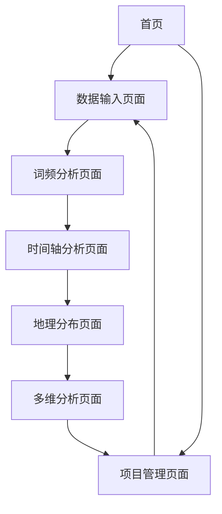

# 历史数据统计分析工具 - 产品需求文档

## 1. 产品概述

面向中学生的历史数据统计分析工具，通过智能文本分析和数据可视化技术，帮助学生深入理解历史事件、人物和地理分布的关联性。
该工具旨在提升中学生的历史学习效率，培养数据分析思维，让历史学习更加直观和有趣。
产品目标是成为中学历史教育的重要辅助工具，提高学生的历史分析能力和学习兴趣。

## 2. 核心功能

### 2.1 用户角色

| 角色 | 注册方式 | 核心权限 |
|------|----------|----------|
| 学生用户 | 邮箱注册或学校账号登录 | 可使用所有分析功能，保存个人分析项目 |
| 教师用户 | 教师认证注册 | 可创建班级项目，查看学生分析报告，管理教学资源 |

### 2.2 功能模块

我们的历史数据统计分析工具包含以下主要页面：
1. **首页**：功能导航、快速分析入口、最近项目展示
2. **数据输入页面**：关键词输入、文档上传、分析参数设置
3. **词频分析页面**：词频统计结果、可视化词云、分类统计图表
4. **时间轴分析页面**：交互式时间轴、事件关联分析、因果关系图
5. **地理分布页面**：动态地理分布图、古今地图对比、区域分析
6. **多维分析页面**：物价分析、气候数据、政治环境分析
7. **项目管理页面**：保存的分析项目、历史记录、导出功能

### 2.3 页面详情

| 页面名称 | 模块名称 | 功能描述 |
|----------|----------|----------|
| 首页 | 导航模块 | 展示主要功能入口，提供快速分析选项 |
| 首页 | 项目展示 | 显示最近分析项目，支持快速访问和继续编辑 |
| 数据输入页面 | 关键词输入 | 支持多关键词输入，智能提示历史相关词汇 |
| 数据输入页面 | 文档上传 | 支持txt、docx、pdf格式上传，自动文本提取 |
| 数据输入页面 | 参数设置 | 设置分析时间范围、地理范围、分析深度等参数 |
| 词频分析页面 | 词频统计 | 自动识别历史事件、人物、地点，统计出现频率 |
| 词频分析页面 | 词云展示 | 生成交互式词云，支持分类筛选和详情查看 |
| 词频分析页面 | 分类图表 | 按事件、人物、地点分类的柱状图和饼图 |
| 时间轴分析页面 | 时间轴展示 | 交互式时间轴，支持缩放和事件详情查看 |
| 时间轴分析页面 | 关联分析 | 分析事件间的因果关系和影响因素 |
| 时间轴分析页面 | 趋势分析 | 展示历史发展趋势和重要转折点 |
| 地理分布页面 | 地图展示 | 动态标注历史事件和人物的地理位置 |
| 地理分布页面 | 古今对比 | 古代地图与现代地图的叠加对比功能 |
| 地理分布页面 | 区域分析 | 支持地图缩放和特定区域的详细分析 |
| 多维分析页面 | 物价分析 | 展示不同历史时期的物价水平变化趋势 |
| 多维分析页面 | 气候分析 | 提供气候数据分析和历史事件的关联性 |
| 多维分析页面 | 政治分析 | 展示政治环境变化和重大政治事件影响 |
| 项目管理页面 | 项目列表 | 管理保存的分析项目，支持编辑和删除 |
| 项目管理页面 | 导出功能 | 支持分析报告导出为PDF、图片等格式 |

## 3. 核心流程

**学生用户流程：**
用户进入首页 → 选择分析方式（关键词或文档上传） → 设置分析参数 → 查看词频分析结果 → 浏览时间轴分析 → 查看地理分布 → 进行多维数据分析 → 保存或导出分析报告

**教师用户流程：**
教师登录 → 创建班级项目 → 设置分析任务 → 学生完成分析 → 查看学生分析报告 → 提供反馈和指导

## 4. 用户界面设计

### 4.1 设计风格

- **主色调**：深蓝色(#2C3E50)和金黄色(#F39C12)，体现历史的厚重感和知识的光辉
- **辅助色**：浅灰色(#ECF0F1)和白色(#FFFFFF)作为背景色
- **按钮样式**：圆角矩形按钮，悬停时有渐变效果
- **字体**：中文使用微软雅黑，英文使用Roboto，标题16-20px，正文14px
- **布局风格**：卡片式布局，清晰的模块划分，适合学生用户的简洁界面
- **图标风格**：线性图标，简洁明了，配合历史主题的装饰元素

### 4.2 页面设计概览

| 页面名称 | 模块名称 | UI元素 |
|----------|----------|---------|
| 首页 | 导航模块 | 大图标导航卡片，渐变背景，悬停动效 |
| 首页 | 项目展示 | 时间线式项目列表，缩略图预览 |
| 数据输入页面 | 关键词输入 | 智能输入框，标签式关键词展示，自动补全下拉 |
| 数据输入页面 | 文档上传 | 拖拽上传区域，进度条，文件类型图标 |
| 词频分析页面 | 词云展示 | 交互式词云，颜色渐变，点击放大效果 |
| 词频分析页面 | 分类图表 | 动态柱状图和饼图，数据标签，图例说明 |
| 时间轴分析页面 | 时间轴展示 | 水平时间轴，事件节点，连接线，缩放控制 |
| 地理分布页面 | 地图展示 | 交互式地图，标记点，信息弹窗，图层切换 |
| 多维分析页面 | 数据图表 | 多种图表类型，数据筛选器，对比视图 |

### 4.3 响应式设计

桌面优先设计，同时适配平板和手机端，确保中学生在不同设备上都能良好使用。支持触摸操作优化，特别是地图和时间轴的交互体验。