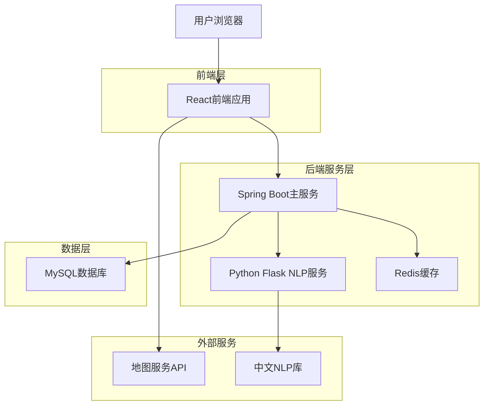
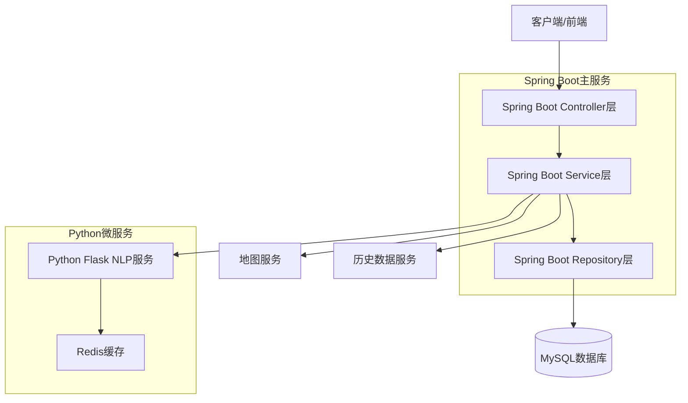
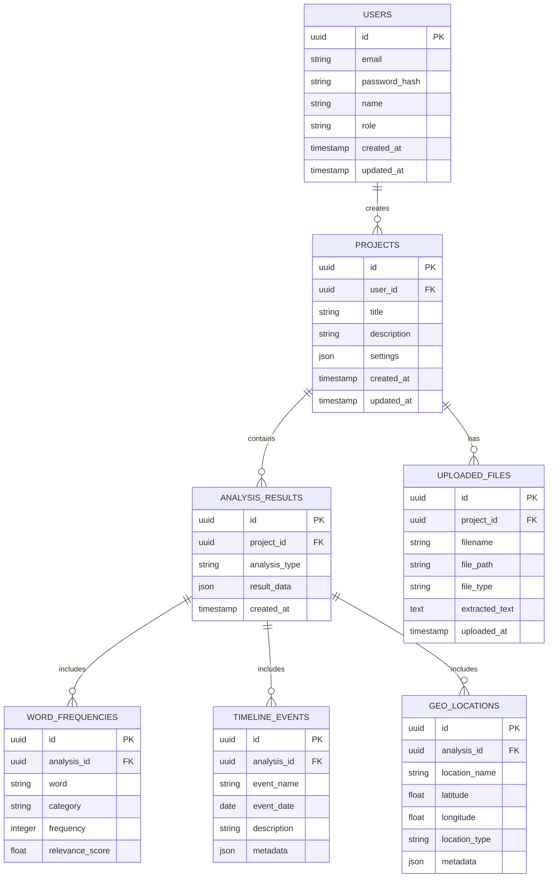

# 历史数据统计分析工具 - 技术架构文档

## 1. 架构设计



## 2. 技术描述

- 前端: React@18 + TypeScript + Ant Design + Vite
- 数据可视化: ECharts@5 + D3.js@7 + React-Wordcloud
- 地图服务: Leaflet + React-Leaflet + OpenStreetMap
- 主后端: Spring Boot@3.2 + Java@17 + Maven
- NLP微服务: Python Flask + jieba + spaCy + pandas
- 数据库: MySQL@8.0
- 缓存: Redis@7.0
- 文件处理: Apache POI (Java) + python-docx (Python)

## 3. 路由定义

| 路由 | 用途 |
|------|------|
| / | 首页，展示主要功能导航和最近项目 |
| /input | 数据输入页面，支持关键词输入和文档上传 |
| /analysis/wordcloud | 词频分析页面，展示词云和统计图表 |
| /analysis/timeline | 时间轴分析页面，显示历史事件时间线 |
| /analysis/geography | 地理分布分析页面，展示地图和地理数据 |
| /analysis/multidim | 多维数据分析页面，物价、气候、政治分析 |
| /projects | 项目管理页面，管理保存的分析项目 |
| /login | 用户登录页面 |
| /register | 用户注册页面 |

## 4. API定义

### 4.1 Spring Boot主服务API

用户认证相关
```
POST /api/auth/login
```

请求:
| 参数名 | 参数类型 | 是否必需 | 描述 |
|--------|----------|----------|------|
| email | String | true | 用户邮箱 |
| password | String | true | 用户密码 |

响应:
| 参数名 | 参数类型 | 描述 |
|--------|----------|------|
| success | Boolean | 登录是否成功 |
| token | String | JWT认证令牌 |
| user | UserDTO | 用户信息对象 |

文档上传分析
```
POST /api/analysis/upload
```

请求:
| 参数名 | 参数类型 | 是否必需 | 描述 |
|--------|----------|----------|------|
| file | MultipartFile | true | 上传的文档文件 |
| analysisType | String | true | 分析类型 |

响应:
| 参数名 | 参数类型 | 描述 |
|--------|----------|------|
| success | Boolean | 上传是否成功 |
| analysisId | String | 分析任务ID |
| extractedText | String | 提取的文本内容 |

项目管理
```
GET /api/projects
POST /api/projects
PUT /api/projects/{id}
DELETE /api/projects/{id}
```

### 4.2 Python Flask NLP服务API

词频分析
```
POST /nlp/analysis/wordfreq
```

请求:
| 参数名 | 参数类型 | 是否必需 | 描述 |
|--------|----------|----------|------|
| text | str | true | 待分析文本 |
| keywords | list | false | 关键词列表 |

响应:
| 参数名 | 参数类型 | 描述 |
|--------|----------|------|
| events | list | 历史事件词频统计 |
| persons | list | 历史人物词频统计 |
| places | list | 历史地点词频统计 |

时间轴分析
```
POST /nlp/analysis/timeline
```

请求:
| 参数名 | 参数类型 | 是否必需 | 描述 |
|--------|----------|----------|------|
| text | str | true | 待分析文本 |
| time_range | dict | false | 时间范围限制 |

响应:
| 参数名 | 参数类型 | 描述 |
|--------|----------|------|
| events | list | 时间轴事件列表 |
| relationships | list | 事件关联关系 |

地理分析
```
POST /nlp/analysis/geography
```

请求:
| 参数名 | 参数类型 | 是否必需 | 描述 |
|--------|----------|----------|------|
| text | str | true | 待分析文本 |
| map_type | str | false | 地图类型 |

响应:
| 参数名 | 参数类型 | 描述 |
|--------|----------|------|
| locations | list | 地理位置数据 |
| distribution | dict | 地理分布统计 |

## 5. 服务器架构图



## 6. 数据模型

### 6.1 数据模型定义



### 6.2 数据定义语言 (MySQL版本)

用户表 (users)
```sql
-- 创建用户表
CREATE TABLE users (
    id VARCHAR(36) PRIMARY KEY DEFAULT (UUID()),
    email VARCHAR(255) UNIQUE NOT NULL,
    password_hash VARCHAR(255) NOT NULL,
    name VARCHAR(100) NOT NULL,
    role ENUM('student', 'teacher') DEFAULT 'student',
    created_at TIMESTAMP DEFAULT CURRENT_TIMESTAMP,
    updated_at TIMESTAMP DEFAULT CURRENT_TIMESTAMP ON UPDATE CURRENT_TIMESTAMP
);

-- 创建项目表
CREATE TABLE projects (
    id UUID PRIMARY KEY DEFAULT gen_random_uuid(),
    user_id UUID NOT NULL,
    title VARCHAR(200) NOT NULL,
    description TEXT,
    settings JSON DEFAULT '{}',
    created_at TIMESTAMP WITH TIME ZONE DEFAULT NOW(),
    updated_at TIMESTAMP WITH TIME ZONE DEFAULT NOW()
);

-- 创建上传文件表
CREATE TABLE uploaded_files (
    id UUID PRIMARY KEY DEFAULT gen_random_uuid(),
    project_id UUID NOT NULL,
    filename VARCHAR(255) NOT NULL,
    file_path VARCHAR(500) NOT NULL,
    file_type VARCHAR(50) NOT NULL,
    extracted_text TEXT,
    uploaded_at TIMESTAMP WITH TIME ZONE DEFAULT NOW()
);

-- 创建分析结果表
CREATE TABLE analysis_results (
    id UUID PRIMARY KEY DEFAULT gen_random_uuid(),
    project_id UUID NOT NULL,
    analysis_type VARCHAR(50) NOT NULL,
    result_data JSON NOT NULL,
    created_at TIMESTAMP WITH TIME ZONE DEFAULT NOW()
);

-- 创建词频统计表
CREATE TABLE word_frequencies (
    id UUID PRIMARY KEY DEFAULT gen_random_uuid(),
    analysis_id UUID NOT NULL,
    word VARCHAR(100) NOT NULL,
    category VARCHAR(50) NOT NULL,
    frequency INTEGER NOT NULL,
    relevance_score FLOAT DEFAULT 0.0
);

-- 创建时间轴事件表
CREATE TABLE timeline_events (
    id UUID PRIMARY KEY DEFAULT gen_random_uuid(),
    analysis_id UUID NOT NULL,
    event_name VARCHAR(200) NOT NULL,
    event_date DATE,
    description TEXT,
    metadata JSON DEFAULT '{}'
);

-- 创建地理位置表
CREATE TABLE geo_locations (
    id UUID PRIMARY KEY DEFAULT gen_random_uuid(),
    analysis_id UUID NOT NULL,
    location_name VARCHAR(200) NOT NULL,
    latitude FLOAT,
    longitude FLOAT,
    location_type VARCHAR(50),
    metadata JSON DEFAULT '{}'
);

-- 创建索引
CREATE INDEX idx_projects_user_id ON projects(user_id);
CREATE INDEX idx_uploaded_files_project_id ON uploaded_files(project_id);
CREATE INDEX idx_analysis_results_project_id ON analysis_results(project_id);
CREATE INDEX idx_word_frequencies_analysis_id ON word_frequencies(analysis_id);
CREATE INDEX idx_timeline_events_analysis_id ON timeline_events(analysis_id);
CREATE INDEX idx_geo_locations_analysis_id ON geo_locations(analysis_id);

-- 权限设置
GRANT SELECT ON users TO anon;
GRANT ALL PRIVILEGES ON users TO authenticated;
GRANT ALL PRIVILEGES ON projects TO authenticated;
GRANT ALL PRIVILEGES ON uploaded_files TO authenticated;
GRANT ALL PRIVILEGES ON analysis_results TO authenticated;
GRANT ALL PRIVILEGES ON word_frequencies TO authenticated;
GRANT ALL PRIVILEGES ON timeline_events TO authenticated;
GRANT ALL PRIVILEGES ON geo_locations TO authenticated;

-- 初始化示例数据
INSERT INTO users (email, password_hash, name, role) VALUES
('student@example.com', '$2b$10$example_hash', '张三', 'student'),
('teacher@example.com', '$2b$10$example_hash', '李老师', 'teacher');

INSERT INTO projects (user_id, title, description) VALUES
((SELECT id FROM users WHERE email = 'student@example.com'), '明朝历史分析', '分析明朝重要历史事件和人物'),
((SELECT id FROM users WHERE email = 'student@example.com'), '唐朝文化研究', '研究唐朝文化发展和地理分布');
```